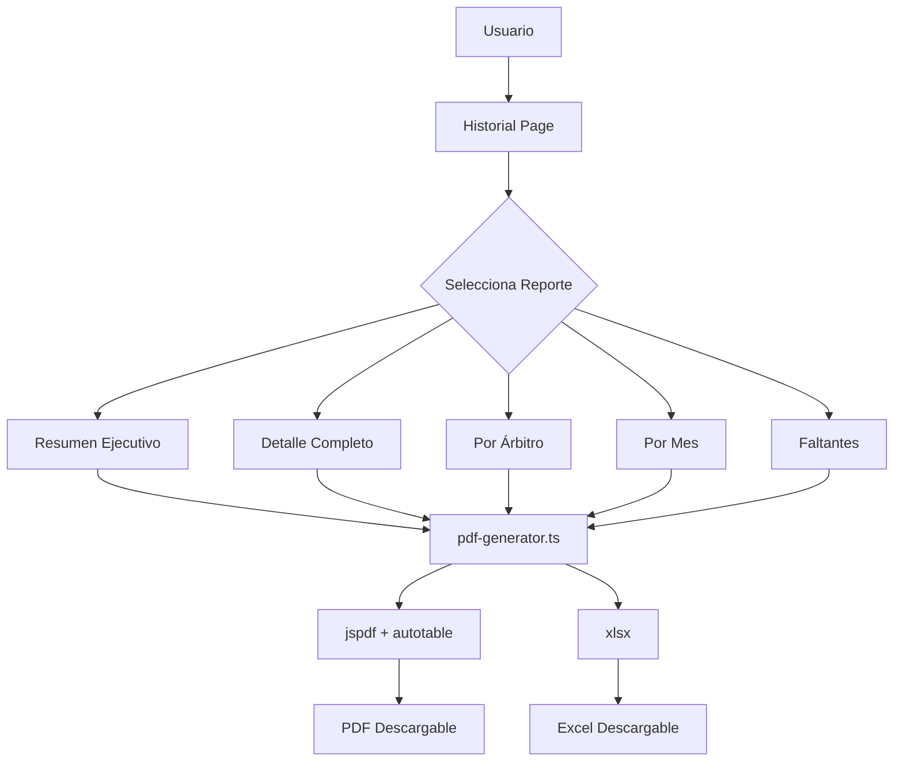

# 📋 Plan: Módulo de Historial de Asistencia con Reportes Profesionales

## 📊 Estado Actual

### Lo que YA existe:
- ✅ Sistema de registro de asistencia con estados (presente, ausente, tardanza, justificado)
- ✅ Página de historial con filtros (por árbitro, actividad, mes)
- ✅ Funcionalidad de edición y eliminación de registros
- ✅ Exportación básica a PDF (usando ventana de impresión del navegador)
- ✅ Librerías instaladas: `jspdf`, `jspdf-autotable`, `html2pdf.js`, `xlsx`
- ✅ Sistema de días obligatorios (Lun, Mar, Jue, Vie, Sáb desde 01/01/2026)

### Lo que FALTA o debe MEJORAR:
- ❌ PDF generado no es un archivo real, usa impresión del navegador
- ❌ No usa las librerías PDF instaladas (jspdf)
- ❌ Falta diseño profesional en los reportes
- ❌ No hay gráficos visuales en los reportes
- ❌ Solo existe un tipo de reporte básico
- ❌ No hay resumen ejecutivo

---

## 🎯 Objetivos del Proyecto

1. **Generar PDFs profesionales y descargables** usando jspdf
2. **Múltiples tipos de reportes** (resumen, detalle, por árbitro, por mes)
3. **Diseño profesional** con branding de SIDAF-PUNO
4. **Estadísticas y gráficos** en los reportes
5. **Exportación a Excel** como alternativa

---

## 📦 Tareas a Realizar

### Fase 1: Mejorar el Generador de PDFs (Prioridad ALTA)

**Archivo:** [`frontend/lib/pdf-generator.ts`](frontend/lib/pdf-generator.ts)

- [ ] **1.1** Migrar de HTML print a jspdf real
- [ ] **1.2** Usar `jspdf-autotable` para tablas profesionales
- [ ] **1.3** Agregar header con logo y branding SIDAF-PUNO
- [ ] **1.4** Agregar numeración de páginas
- [ ] **1.5** Agregar pie de página con fecha de generación

### Fase 2: Nuevos Tipos de Reportes (Prioridad ALTA)

- [ ] **2.1** Reporte de RESUMEN EJECUTIVO
  - Estadísticas generales
  - Porcentajes de asistencia
  - Días obligatorios vs realizados
  
- [ ] **2.2** Reporte por ÁRBITRO
  - Historial individual
  - Porcentaje de asistencia
  - Tardanzas y justificaciones
  
- [ ] **2.3** Reporte MENSUAL
  - Resumen del mes seleccionado
  - Comparación con meses anteriores
  - Días obligatorios del mes

- [ ] **2.4** Reporte de FALTANTES
  - Días sin registro
  - Árbitros con más ausencias

### Fase 3: Mejorar Página de Historial (Prioridad MEDIA)

**Archivo:** [`frontend/app/(dashboard)/dashboard/asistencia/historial/page.tsx`](frontend/app/(dashboard)/dashboard/asistencia/historial/page.tsx)

- [ ] **3.1** Agregar botones de exportación mejorados
- [ ] **3.2** Selector de tipo de reporte
- [ ] **3.3** Vista previa antes de exportar
- [ ] **3.4** Indicador de progreso durante generación

### Fase 4: Gráficos Visuales (Prioridad MEDIA)

- [ ] **4.1** Agregar gráfico de asistencia por mes
- [ ] **4.2** Agregar ranking de árbitros
- [ ] **4.3** Incluir gráficos en PDFs (usando jspdf o como imágenes)

### Fase 5: Exportación Excel (Prioridad BAJA)

- [ ] **5.1** Implementar exportación a XLSX usando librería `xlsx`
- [ ] **5.2** Agregar botón en historial

---

## 🏗️ Arquitectura Técnica



---

## 📄 Estructura del PDF Profesional

```
┌─────────────────────────────────────────────────────────┐
│  🏆 SIDAF-PUNO                              Página 1/5 │
│  Sistema de Designación Inteligente de Árbitros        │
│  ─────────────────────────────────────────────────────  │
│                                                         │
│  📊 REPORTE DE ASISTENCIA - RESUMEN EJECUTIVO         │
│                                                         │
│  Período: Enero 2026                                   │
│  Fecha de generación: 18/03/2026 20:26                 │
│                                                         │
├─────────────────────────────────────────────────────────┤
│  📈 ESTADÍSTICAS GENERALES                            │
│  ┌─────────┬─────────┬─────────┬─────────┐              │
│  │Total    │Días    │Días    │%        │              │
│  │Días    │Obligat.│Realizad│Asistenc.│              │
│  ├─────────┼─────────┼─────────┼─────────┤              │
│  │  22    │   20   │   18   │  90%    │              │
│  └─────────┴─────────┴─────────┴─────────┘              │
├─────────────────────────────────────────────────────────┤
│  📋 DETALLE DE ASISTENCIAS                             │
│  ┌──────┬──────────┬─────────┬──────────┬─────────┐    │
│  │Fecha │Día       │Árbitro │Actividad │Estado   │    │
│  ├──────┼──────────┼─────────┼──────────┼─────────┤    │
│  │18/03 │Martes    │Juan P. │Prep.Fís. │Presente │    │
│  │17/03 │Lunes     │Carlos M│Análisis  │Tardanza │    │
│  └──────┴──────────┴─────────┴──────────┴─────────┘    │
├─────────────────────────────────────────────────────────┤
│  Generado por SIDAF-PUNO | Comisión de Árbitros - Puno │
└─────────────────────────────────────────────────────────┘
```

---

## 📝 Especificaciones del PDF

### Dimensiones y Formato
- Tamaño: A4 (210mm x 297mm)
- Orientación: Vertical (Portrait)
- Márgenes: 20mm

### Colores Corporativos
- Primary: `#2563eb` (Azul)
- Secondary: `#7c3aed` (Púrpura)
- Success: `#16a34a` (Verde)
- Danger: `#dc2626` (Rojo)
- Warning: `#d97706` (Naranja)

### Fuentes
- Título: Helvetica Bold, 16pt
- Subtítulos: Helvetica Bold, 12pt
- Cuerpo: Helvetica, 10pt
- Tablas: Helvetica, 9pt

---

## 📅 Orden de Implementación Sugerido

| Paso | Tarea | Prioridad |
|------|-------|-----------|
| 1 | Reescribir pdf-generator.ts con jspdf real | 🔴 ALTA |
| 2 | Agregar reporte de resumen ejecutivo | 🔴 ALTA |
| 3 | Agregar reporte por árbitro | 🟡 MEDIA |
| 4 | Agregar reporte mensual | 🟡 MEDIA |
| 5 | Mejorar UI del historial | 🟡 MEDIA |
| 6 | Agregar gráficos al PDF | 🟢 BAJA |
| 7 | Agregar exportación Excel | 🟢 BAJA |

---

## 🔧 Recursos Necesarios

### Librerías (ya instaladas)
- `jspdf` v4.0.0
- `jspdf-autotable` v5.0.7
- `html2pdf.js` v0.12.1
- `xlsx` v0.18.5
- `recharts` (para gráficos en frontend)

### Archivos a Modificar
1. [`frontend/lib/pdf-generator.ts`](frontend/lib/pdf-generator.ts) - Regenerar completamente
2. [`frontend/app/(dashboard)/dashboard/asistencia/historial/page.tsx`](frontend/app/(dashboard)/dashboard/asistencia/historial/page.tsx) - Agregar botones
3. [`frontend/app/(dashboard)/dashboard/reportes/page.tsx`](frontend/app/(dashboard)/dashboard/reportes/page.tsx) - Mejorar existentes

---

## ✅ Checklist de Entrega

- [ ] PDFs se descargan directamente (no ventana de impresión)
- [ ] Header con branding SIDAF-PUNO
- [ ] Al menos 4 tipos de reportes disponibles
- [ ] Tablas con formato profesional
- [ ] Numeración de páginas
- [ ] Pie de página con fecha
- [ ] Exportación a Excel funciona
- [ ] UI intuitiva y profesional
