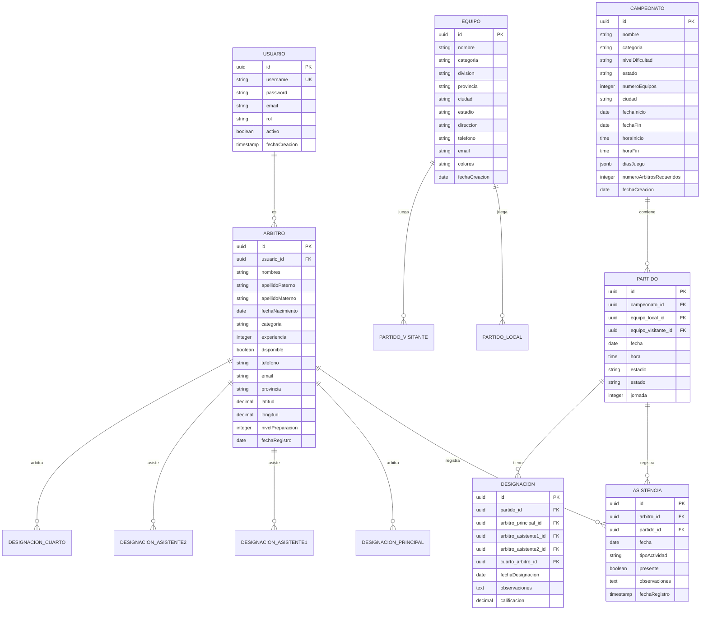

# 🏗️ SIDAF-PUNO - Arquitectura del Backend

## 📋 Documento de Diseño Técnico

**Versión:** 1.0  
**Fecha:** Febrero 2025  
**Tecnología:** PostgreSQL + Spring Boot 3.x

---

## 📑 Tabla de Contenidos

1. [Visión General](#visión-general)
2. [Arquitectura del Sistema](#arquitectura-del-sistema)
3. [Modelo de Datos PostgreSQL](#modelo-de-datos-postgresql)
4. [Arquitectura de Capas Spring Boot](#arquitectura-de-capas-spring-boot)
5. [API REST](#api-rest)
6. [Seguridad y Autenticación](#seguridad-y-autenticación)
7. [Algoritmo de Designación](#algoritmo-de-designación)
8. [Plan de Implementación](#plan-de-implementación)
9. [Configuración y Deploy](#configuración-y-deploy)

---

## 👁️ Visión General

### Descripción del Backend

El backend de **SIDAF-PUNO** será una API REST construida con **Spring Boot 3.x** que utilizará **PostgreSQL** como base de datos relacional. El sistema proporcionará servicios para:

- ✅ Gestión completa de árbitros
- ✅ Administración de equipos y provincias
- ✅ Control de campeonatos y calendario
- ✅ Registro de asistencia diario
- ✅ Designación inteligente de árbitros
- ✅ Generación de reportes y estadísticas

### Objetivos de Arquitectura

1. **Escalabilidad**: Capacidad de crecer con la demanda
2. **Mantenibilidad**: Código limpio y organizado
3. **Seguridad**: Protección de datos y autenticación
4. **Rendimiento**: Respuestas rápidas y eficientes
5. **Documentación**: API auto-documentada

---

## 🏗️ Arquitectura del Sistema

### Diagrama de Arquitectura General

```
┌─────────────────────────────────────────────────────────────────────┐
│                          CLIENTE (Frontend)                          │
│                    Next.js + TypeScript + Tailwind                   │
└────────────────────────────┬────────────────────────────────────────┘
                             │
                             ▼ HTTP/REST
┌─────────────────────────────────────────────────────────────────────┐
│                     API GATEWAY (Opcional)                           │
│                    (Spring Cloud Gateway o Nginx)                     │
└────────────────────────────┬────────────────────────────────────────┘
                             │
                             ▼
┌─────────────────────────────────────────────────────────────────────┐
│                    SPRING BOOT APPLICATION                           │
│  ┌─────────────────────────────────────────────────────────────┐   │
│  │                     CONTROLLERS                               │   │
│  │  /api/arbitros, /api/campeonatos, /api/designaciones        │   │
│  └─────────────────────────────────────────────────────────────┘   │
│                              │                                       │
│                              ▼                                       │
│  ┌─────────────────────────────────────────────────────────────┐   │
│  │                     SERVICES                                 │   │
│  │  Lógica de negocio y algoritmos                             │   │
│  └─────────────────────────────────────────────────────────────┘   │
│                              │                                       │
│                              ▼                                       │
│  ┌─────────────────────────────────────────────────────────────┐   │
│  │                     REPOSITORIES                             │   │
│  │  Acceso a datos con Spring Data JPA                          │   │
│  └─────────────────────────────────────────────────────────────┘   │
│                              │                                       │
│                              ▼                                       │
│  ┌─────────────────────────────────────────────────────────────┐   │
│  │                    SPRING SECURITY                           │   │
│  │  JWT, roles y permisos                                      │   │
│  └─────────────────────────────────────────────────────────────┘   │
└────────────────────────────┬────────────────────────────────────────┘
                             │
                             ▼
┌─────────────────────────────────────────────────────────────────────┐
│                      POSTGRESQL DATABASE                             │
│  ┌─────────┐ ┌──────────┐ ┌──────────┐ ┌──────────┐               │
│  │ arbitros│ │equipos   │ │campeonato│ │asistencia│               │
│  └─────────┘ └──────────┘ └──────────┘ └──────────┘               │
└─────────────────────────────────────────────────────────────────────┘
```

### Stack Tecnológico

```yaml
# Dependencias principales
Spring Boot:
  version: 3.2.0+
  dependencies:
    - spring-boot-starter-web
    - spring-boot-starter-data-jpa
    - spring-boot-starter-security
    - spring-boot-starter-validation
    - spring-boot-starter-cache
    - spring-boot-starter-mail

Database:
  PostgreSQL: 15+
  Driver: PostgreSQL JDBC Driver

Seguridad:
  JWT: jjwt-api 0.12.3
  OAuth2: spring-security-oauth2-resource-server

Documentación:
  Swagger: springdoc-openapi-starter 2.3.0

Testing:
  JUnit 5
  Mockito
  TestContainers

Build:
  Maven 3.9+
  Java 17+
```

---

## 📊 Modelo de Datos PostgreSQL

### Diagrama Entidad-Relación



### Esquema de Base de Datos

#### Tabla: `usuarios`

```sql
-- usuarios: Usuarios del sistema (adminitradores)
CREATE TABLE usuarios (
    id UUID PRIMARY KEY DEFAULT gen_random_uuid(),
    username VARCHAR(50) UNIQUE NOT NULL,
    password VARCHAR(255) NOT NULL,
    email VARCHAR(100) UNIQUE NOT NULL,
    rol VARCHAR(20) NOT NULL DEFAULT 'USER',
    activo BOOLEAN DEFAULT true,
    fecha_creacion TIMESTAMP DEFAULT CURRENT_TIMESTAMP,
    ultimo_acceso TIMESTAMP
);

-- Índices
CREATE INDEX idx_usuario_username ON usuarios(username);
CREATE INDEX idx_usuario_email ON usuarios(email);
```

#### Tabla: `provincias` (Catálogo)

```sql
-- provincias: Provincias del departamento de Puno
CREATE TABLE provincias (
    id SERIAL PRIMARY KEY,
    nombre VARCHAR(100) NOT NULL UNIQUE,
    codigo VARCHAR(10) UNIQUE,
    region VARCHAR(50) DEFAULT 'Puno',
    activo BOOLEAN DEFAULT true
);

-- Datos iniciales
INSERT INTO provincias (nombre, codigo) VALUES
('Puno', 'PU01'),
('Azángaro', 'PU02'),
('Carabaya', 'PU03'),
('Chucuito', 'PU04'),
('El Collao', 'PU05'),
('Huancané', 'PU06'),
('Lampa', 'PU07'),
('Melgar', 'PU08'),
('Moho', 'PU09'),
('San Antonio de Putina', 'PU10'),
('San Román', 'PU11'),
('Sandia', 'PU12'),
('Yunguyo', 'PU13');
```

#### Tabla: `arbitros`

```sql
-- arbitros: Árbitros de fútbol
CREATE TABLE arbitros (
    id UUID PRIMARY KEY DEFAULT gen_random_uuid(),
    usuario_id UUID REFERENCES usuarios(id) ON DELETE SET NULL,
    nombres VARCHAR(100) NOT NULL,
    apellido_paterno VARCHAR(50) NOT NULL,
    apellido_materno VARCHAR(50),
    fecha_nacimiento DATE,
    categoria VARCHAR(20) NOT NULL CHECK (categoria IN ('FIFA', 'NACIONAL', 'REGIONAL', 'PROVINCIAL')),
    experiencia INTEGER DEFAULT 0,
    disponible BOOLEAN DEFAULT true,
    telefono VARCHAR(20),
    email VARCHAR(100),
    provincia_id INTEGER REFERENCES provincias(id),
    latitud DECIMAL(10, 8),
    longitud DECIMAL(11, 8),
    nivel_preparacion INTEGER DEFAULT 0 CHECK (nivel_preparacion BETWEEN 0 AND 100),
    observaciones TEXT,
    fecha_registro DATE DEFAULT CURRENT_DATE,
    activo BOOLEAN DEFAULT true,
    created_at TIMESTAMP DEFAULT CURRENT_TIMESTAMP,
    updated_at TIMESTAMP DEFAULT CURRENT_TIMESTAMP
);

-- Índices
CREATE INDEX idx_arbitro_categoria ON arbitros(categoria);
CREATE INDEX idx_arbitro_provincia ON arbitros(provincia_id);
CREATE INDEX idx_arbitro_disponible ON arbitros(disponible);
CREATE INDEX idx_aractivo ON arbitros(activo);

-- Constraints
ALTER TABLE arbitros ADD CONSTRAINT chk_nivel_preparacion 
    CHECK (nivel_preparacion >= 0 AND nivel_preparacion <= 100);
```

#### Tabla: `equipos`

```sql
-- equipos: Equipos de fútbol participantes
CREATE TABLE equipos (
    id UUID PRIMARY KEY DEFAULT gen_random_uuid(),
    nombre VARCHAR(100) NOT NULL,
    categoria VARCHAR(50),
    division VARCHAR(30) CHECK (division IN ('PRIMERA', 'SEGUNDA')),
    provincia_id INTEGER REFERENCES provincias(id),
    ciudad VARCHAR(100),
    estadio VARCHAR(150),
    direccion VARCHAR(255),
    telefono VARCHAR(20),
    email VARCHAR(100),
    colores VARCHAR(100),
    logo_url VARCHAR(500),
    activo BOOLEAN DEFAULT true,
    fecha_creacion DATE DEFAULT CURRENT_DATE,
    created_at TIMESTAMP DEFAULT CURRENT_TIMESTAMP,
    updated_at TIMESTAMP DEFAULT CURRENT_TIMESTAMP
);

-- Índices
CREATE INDEX idx_equipo_nombre ON equipos(nombre);
CREATE INDEX idx_equipo_provincia ON equipos(provincia_id);
CREATE INDEX idx_equipo_division ON equipos(division);
CREATE INDEX idx_equipo_activo ON equipos(activo);
```

#### Tabla: `campeonatos`

```sql
-- campeonatos: Torneos y competiciones
CREATE TABLE campeonatos (
    id UUID PRIMARY KEY DEFAULT gen_random_uuid(),
    nombre VARCHAR(150) NOT NULL,
    categoria VARCHAR(100),
    nivel_dificultad VARCHAR(20) CHECK (nivel_dificultad IN ('ALTO', 'MEDIO', 'BAJO')),
    estado VARCHAR(20) DEFAULT 'PROGRAMADO' CHECK (estado IN ('PROGRAMADO', 'ACTIVO', 'FINALIZADO', 'SUSPENDIDO')),
    numero_equipos INTEGER,
    ciudad VARCHAR(100),
    fecha_inicio DATE,
    fecha_fin DATE,
    hora_inicio TIME,
    hora_fin TIME,
    dias_juego JSONB,
    numero_arbitros_requeridos INTEGER DEFAULT 4,
    formato VARCHAR(50),
    observaciones TEXT,
    logo_url VARCHAR(500),
    activo BOOLEAN DEFAULT true,
    fecha_creacion DATE DEFAULT CURRENT_DATE,
    created_at TIMESTAMP DEFAULT CURRENT_TIMESTAMP,
    updated_at TIMESTAMP DEFAULT CURRENT_TIMESTAMP
);

-- Índices
CREATE INDEX idx_campeonato_estado ON campeonatos(estado);
CREATE INDEX idx_campeonato_nivel ON campeonatos(nivel_dificultad);
CREATE INDEX idx_campeonato_fecha ON campeonatos(fecha_inicio);
```

#### Tabla: `campeonato_equipos` (Relación N:M)

```sql
-- Campeonato equipos: Equipos participantes en cada campeonato
CREATE TABLE campeonato_equipos (
    id SERIAL PRIMARY KEY,
    campeonato_id UUID NOT NULL REFERENCES campeonatos(id) ON DELETE CASCADE,
    equipo_id UUID NOT NULL REFERENCES equipos(id) ON DELETE CASCADE,
    grupo VARCHAR(10),
    puntos INTEGER DEFAULT 0,
    partidos_jugados INTEGER DEFAULT 0,
    partidos_ganados INTEGER DEFAULT 0,
    partidos_empatados INTEGER DEFAULT 0,
    partidos_perdidos INTEGER DEFAULT 0,
    created_at TIMESTAMP DEFAULT CURRENT_TIMESTAMP,
    UNIQUE(campeonato_id, equipo_id)
);

CREATE INDEX idx_camp_equipo_campeonato ON campeonato_equipos(campeonato_id);
```

#### Tabla: `partidos`

```sql
-- partidos: Partidos de los campeonatos
CREATE TABLE partidos (
    id UUID PRIMARY KEY DEFAULT gen_random_uuid(),
    campeonato_id UUID NOT NULL REFERENCES campeonatos(id) ON DELETE CASCADE,
    equipo_local_id UUID NOT NULL REFERENCES equipos(id),
    equipo_visitante_id UUID NOT NULL REFERENCES equipos(id),
    fecha DATE NOT NULL,
    hora TIME NOT NULL,
    estadio VARCHAR(150),
    jornada INTEGER,
    estado VARCHAR(20) DEFAULT 'PROGRAMADO' CHECK (estado IN ('PROGRAMADO', 'EN_CURSO', 'FINALIZADO', 'SUSPENDIDO', 'APLazADO')),
    gol_local INTEGER,
    gol_visitante INTEGER,
    observaciones TEXT,
    created_at TIMESTAMP DEFAULT CURRENT_TIMESTAMP,
    updated_at TIMESTAMP DEFAULT CURRENT_TIMESTAMP
);

-- Índices
CREATE INDEX idx_partido_fecha ON partidos(fecha);
CREATE INDEX idx_partido_campeonato ON partidos(campeonato_id);
CREATE INDEX idx_partido_estado ON partidos(estado);
CREATE INDEX idx_partido_estadio ON partidos(estadio);
```

#### Tabla: `asistencias`

```sql
-- asistencias: Registro de asistencia de árbitros
CREATE TABLE asistencia (
    id UUID PRIMARY KEY DEFAULT gen_random_uuid(),
    arbitro_id UUID NOT NULL REFERENCES arbitros(id) ON DELETE CASCADE,
    partido_id UUID REFERENCES partidos(id) ON DELETE CASCADE,
    fecha DATE NOT NULL,
    tipo_actividad VARCHAR(50) CHECK (tipo_actividad IN (
        'PREPARACION_FISICA',
        'ENTRENAMIENTO_TECNICO',
        'REUNION_TACTICA',
        'PARTIDO',
        'CHARLA',
        'CURSO'
    )),
    presente BOOLEAN DEFAULT false,
    llegada_tarde_minutos INTEGER DEFAULT 0,
    observaciones TEXT,
    registrado_por UUID REFERENCES usuarios(id),
    created_at TIMESTAMP DEFAULT CURRENT_TIMESTAMP
);

-- Índices
CREATE INDEX idx_asistencia_fecha ON asistencia(fecha);
CREATE INDEX idx_asistencia_arbitro ON asistencia(arbitro_id);
CREATE INDEX idx_asistencia_tipo ON asistencia(tipo_actividad);
```

#### Tabla: `designaciones`

```sql
-- designaciones: Designaciones de árbitros a partidos
CREATE TABLE designaciones (
    id UUID PRIMARY KEY DEFAULT gen_random_uuid(),
    partido_id UUID NOT NULL REFERENCES partidos(id) ON DELETE CASCADE,
    arbitro_principal_id UUID NOT NULL REFERENCES arbitros(id),
    arbitro_asistente1_id UUID NOT NULL REFERENCES arbitros(id),
    arbitro_asistente2_id UUID NOT NULL REFERENCES arbitros(id),
    cuarto_arbitro_id UUID REFERENCES arbitros(id),
    var_arbitro_id UUID REFERENCES arbitros(id),
    fecha_designacion DATE DEFAULT CURRENT_DATE,
    hora_designacion TIME DEFAULT CURRENT_TIME,
    observaciones TEXT,
    estado VARCHAR(20) DEFAULT 'CONFIRMADA' CHECK (estado IN ('PENDIENTE', 'CONFIRMADA', 'CANCELADA', 'COMPLETADA')),
    calificacion_final DECIMAL(3, 2),
    created_at TIMESTAMP DEFAULT CURRENT_TIMESTAMP,
    updated_at TIMESTAMP DEFAULT CURRENT_TIMESTAMP
);

-- Índices
CREATE INDEX idx_designacion_partido ON designaciones(partido_id);
CREATE INDEX idx_designacion_fecha ON designaciones(fecha_designacion);
CREATE INDEX idx_designacion_arbitro ON designaciones(arbitro_principal_id);

-- Constraints
ALTER TABLE designaciones ADD CONSTRAINT chk_arbitros_diferentes
    CHECK (
        arbitro_principal_id <> arbitro_asistente1_id AND
        arbitro_principal_id <> arbitro_asistente2_id AND
        arbitro_principal_id <> cuarto_arbitro_id AND
        arbitro_asistente1_id <> arbitro_asistente2_id AND
        arbitro_asistente1_id <> cuarto_arbitro_id AND
        arbitro_asistente2_id <> cuarto_arbitro_id
    );
```

#### Tabla: `logs_sistema`

```sql
-- logs_sistema: Auditoría de acciones
CREATE TABLE logs_sistema (
    id SERIAL PRIMARY KEY,
    usuario_id UUID REFERENCES usuarios(id),
    accion VARCHAR(50) NOT NULL,
    entidad VARCHAR(50) NOT NULL,
    entidad_id UUID,
    detalles JSONB,
    ip_cliente INET,
    user_agent TEXT,
    created_at TIMESTAMP DEFAULT CURRENT_TIMESTAMP
);

CREATE INDEX idx_log_usuario ON logs_sistema(usuario_id);
CREATE INDEX idx_log_accion ON logs_sistema(accion);
CREATE INDEX idx_log_fecha ON logs_sistema(created_at);
```

### Funciones y Triggers

```sql
-- Trigger para actualizar fecha de modificación
CREATE OR REPLACE FUNCTION update_updated_at()
RETURNS TRIGGER AS $$
BEGIN
    NEW.updated_at = CURRENT_TIMESTAMP;
    RETURN NEW;
END;
$$ LANGUAGE plpgsql;

-- Aplicar trigger a tablas principales
CREATE TRIGGER update_arbitros_updated_at
    BEFORE UPDATE ON arbitros
    FOR EACH ROW EXECUTE FUNCTION update_updated_at();

CREATE TRIGGER update_equipos_updated_at
    BEFORE UPDATE ON equipos
    FOR EACH ROW EXECUTE FUNCTION update_updated_at();

CREATE TRIGGER update_campeonatos_updated_at
    BEFORE UPDATE ON campeonatos
    FOR EACH ROW EXECUTE FUNCTION update_updated_at();

CREATE TRIGGER update_partidos_updated_at
    BEFORE UPDATE ON partidos
    FOR EACH ROW EXECUTE FUNCTION update_updated_at();
```

---

## 🏛️ Arquitectura de Capas Spring Boot

### Estructura de Paquetes

```
sidaf-puno-backend/
├── src/
│   ├── main/
│   │   ├── java/com/sidaf/puno/
│   │   │   ├── SidafPunoApplication.java
│   │   │   │
│   │   │   ├── config/                  # Configuración
│   │   │   │   ├── AppConfig.java
│   │   │   │   ├── SecurityConfig.java
│   │   │   │   ├── SwaggerConfig.java
│   │   │   │   ├── CacheConfig.java
│   │   │   │   └── WebConfig.java
│   │   │   │
│   │   │   ├── controller/             # Controladores REST
│   │   │   │   ├── ArbitroController.java
│   │   │   │   ├── EquipoController.java
│   │   │   │   ├── CampeonatoController.java
│   │   │   │   ├── PartidoController.java
│   │   │   │   ├── AsistenciaController.java
│   │   │   │   ├── DesignacionController.java
│   │   │   │   ├── AuthController.java
│   │   │   │   └── ReporteController.java
│   │   │   │
│   │   │   ├── service/                # Lógica de negocio
│   │   │   │   ├── ArbitroService.java
│   │   │   │   ├── EquipoService.java
│   │   │   │   ├── CampeonatoService.java
│   │   │   │   ├── PartidoService.java
│   │   │   │   ├── AsistenciaService.java
│   │   │   │   ├── DesignacionService.java
│   │   │   │   ├── ReporteService.java
│   │   │   │   └── impl/
│   │   │   │       ├── ArbitroServiceImpl.java
│   │   │   │       └── ...
│   │   │   │
│   │   │   ├── repository/            # Repositorios JPA
│   │   │   │   ├── ArbitroRepository.java
│   │   │   │   ├── EquipoRepository.java
│   │   │   │   ├── CampeonatoRepository.java
│   │   │   │   ├── PartidoRepository.java
│   │   │   │   ├── AsistenciaRepository.java
│   │   │   │   ├── DesignacionRepository.java
│   │   │   │   └── UsuarioRepository.java
│   │   │   │
│   │   │   ├── entity/                # Entidades JPA
│   │   │   │   ├── Arbitro.java
│   │   │   │   ├── Equipo.java
│   │   │   │   ├── Campeonato.java
│   │   │   │   ├── Partido.java
│   │   │   │   ├── Asistencia.java
│   │   │   │   ├── Designacion.java
│   │   │   │   ├── Usuario.java
│   │   │   │   └── Provincia.java
│   │   │   │
│   │   │   ├── dto/                  # Data Transfer Objects
│   │   │   │   ├── request/
│   │   │   │   │   ├── ArbitroRequest.java
│   │   │   │   │   ├── DesignacionRequest.java
│   │   │   │   │   └── ...
│   │   │   │   └── response/
│   │   │   │       ├── ArbitroResponse.java
│   │   │   │       ├── DesignacionResponse.java
│   │   │   │       └── ...
│   │   │   │
│   │   │   ├── mapper/               # Mapeo DTO-Entidad
│   │   │   │   ├── ArbitroMapper.java
│   │   │   │   ├── EntityMapper.java
│   │   │   │   └── CustomMapper.java
│   │   │   │
│   │   │   ├── exception/           # Excepciones personalizadas
│   │   │   │   ├── ResourceNotFoundException.java
│   │   │   │   ├── BadRequestException.java
│   │   │   │   ├── GlobalExceptionHandler.java
│   │   │   │   └── ...
│   │   │   │
│   │   │   ├── security/            # Seguridad JWT
│   │   │   │   ├── JwtTokenProvider.java
│   │   │   │   ├── JwtAuthenticationFilter.java
│   │   │   │   ├── UserDetailsServiceImpl.java
│   │   │   │   └── SecurityConstants.java
│   │   │   │
│   │   │   ├── algorithm/           # Algoritmos de designación
│   │   │   │   ├── DesignacionAlgoritmo.java
│   │   │   │   └── CalificacionService.java
│   │   │   │
│   │   │   └── util/                # Utilidades
│   │   │       ├── DateUtils.java
│   │   │       ├── ApiResponse.java
│   │   │       └── PageUtils.java
│   │   │
│   │   └── resources/
│   │       ├── application.yml
│   │       ├── application-dev.yml
│   │       ├── application-prod.yml
│   │       └── db/migration/
│   │           ├── V1__init_schema.sql
│   │           └── V2__seed_data.sql
│   │
│   └── test/
│       └── java/com/sidaf/puno/
│           ├── controller/
│           ├── service/
│           └── repository/
│
└── pom.xml
```

### Descripción de Capas

#### 1. **Entity Layer** (Entidades)

```java
// Ejemplo: Entidad Arbitro
@Entity
@Table(name = "arbitros")
@EntityListeners(AuditingEntityListener.class)
public class Arbitro {
    
    @Id
    @GeneratedValue(strategy = GenerationType.UUID)
    private UUID id;
    
    @Column(name = "nombres", nullable = false, length = 100)
    private String nombres;
    
    @Column(name = "apellido_paterno", nullable = false, length = 50)
    private String apellidoPaterno;
    
    @Enumerated(EnumType.STRING)
    @Column(name = "categoria", nullable = false)
    private CategoriaArbitro categoria;
    
    @Column(name = "experiencia")
    private Integer experiencia;
    
    @Column(name = "disponible")
    private Boolean disponible;
    
    @Column(name = "nivel_preparacion")
    private Integer nivelPreparacion;
    
    // Constructores, Getters, Setters
}
```

#### 2. **Repository Layer** (Repositorios)

```java
// Ejemplo: ArbitroRepository
public interface ArbitroRepository extends JpaRepository<Arbitro, UUID> {
    
    List<Arbitro> findByActivoTrue();
    
    List<Arbitro> findByCategoriaAndActivoTrue(CategoriaArbitro categoria);
    
    List<Arbitro> findByProvinciaIdAndActivoTrue(Integer provinciaId);
    
    @Query("SELECT a FROM Arbitro a WHERE a.disponible = true AND a.nivelPreparacion >= :minNivel")
    List<Arbitro> findArbitrosDisponiblesConNivelMinimo(@Param("minNivel") Integer minNivel);
    
    @Query("SELECT a FROM Arbitro a WHERE a.disponible = true " +
           "AND a.categoria IN :categorias " +
           "AND a.nivelPreparacion >= :minNivel " +
           "ORDER BY a.nivelPreparacion DESC")
    List<Arbitro> findArbitrosCalificados(
        @Param("categorias") List<CategoriaArbitro> categorias,
        @Param("minNivel") Integer minNivel
    );
    
    boolean existsByEmail(String email);
}
```

#### 3. **Service Layer** (Servicios)

```java
// Ejemplo: DesignacionService
public interface DesignacionService {
    
    DesignacionResponse crearDesignacion(DesignacionRequest request);
    
    DesignacionResponse generarDesignacionAutomatica(UUID partidoId);
    
    List<DesignacionResponse> listarDesignaciones();
    
    DesignacionResponse obtenerDesignacion(UUID id);
    
    void cancelarDesignacion(UUID id);
    
    List<DesignacionResponse> listarDesignacionesPorFecha(LocalDate fecha);
}
```

#### 4. **Controller Layer** (Controladores)

```java
// Ejemplo: ArbitroController
@RestController
@RequestMapping("/api/arbitros")
@RequiredArgsConstructor
@Tag(name = "Árbitros", description = "Gestión de árbitros")
public class ArbitroController {
    
    private final ArbitroService arbitroService;
    
    @GetMapping
    @Operation(summary = "Listar árbitros", description = "Retorna lista paginada de árbitros")
    public ResponseEntity<Page<ArbitroResponse>> listarArbitros(
            @RequestParam(defaultValue = "0") int page,
            @RequestParam(defaultValue = "10") int size,
            @RequestParam(required = false) String categoria,
            @RequestParam(required = false) String provincia) {
        return ResponseEntity.ok(arbitroService.listar(page, size, categoria, provincia));
    }
    
    @PostMapping
    @Operation(summary = "Crear árbitro")
    @PreAuthorize("hasRole('ADMIN')")
    public ResponseEntity<ArbitroResponse> crearArbitro(@Valid @RequestBody ArbitroRequest request) {
        return ResponseEntity.status(HttpStatus.CREATED)
                .body(arbitroService.crear(request));
    }
    
    @GetMapping("/{id}")
    @Operation(summary = "Obtener árbitro por ID")
    public ResponseEntity<ArbitroResponse> obtenerArbitro(@PathVariable UUID id) {
        return ResponseEntity.ok(arbitroService.obtenerPorId(id));
    }
    
    @PutMapping("/{id}")
    @Operation(summary = "Actualizar árbitro")
    @PreAuthorize("hasRole('ADMIN')")
    public ResponseEntity<ArbitroResponse> actualizarArbitro(
            @PathVariable UUID id,
            @Valid @RequestBody ArbitroRequest request) {
        return ResponseEntity.ok(arbitroService.actualizar(id, request));
    }
    
    @DeleteMapping("/{id}")
    @Operation(summary = "Eliminar árbitro")
    @PreAuthorize("hasRole('ADMIN')")
    public ResponseEntity<Void> eliminarArbitro(@PathVariable UUID id) {
        arbitroService.eliminar(id);
        return ResponseEntity.noContent().build();
    }
}
```

---

## 🌐 API REST

### Endpoints por Módulo

#### **Autenticación**

```yaml
POST   /api/auth/login
POST   /api/auth/register
POST   /api/auth/refresh-token
POST   /api/auth/logout
GET    /api/auth/me
```

#### **Árbitros**

```yaml
GET    /api/arbitros                    # Lista paginada
GET    /api/arbitros/{id}               # Obtener por ID
POST   /api/arbitros                    # Crear
PUT    /api/arbitros/{id}              # Actualizar
DELETE /api/arbitros/{id}              # Eliminar (soft delete)
GET    /api/arbitros/disponibles       # Disponibles
GET    /api/arbitros/categoria/{cat}    # Por categoría
GET    /api/arbitros/provincia/{id}    # Por provincia
GET    /api/arbitros/stats             # Estadísticas
```

#### **Equipos**

```yaml
GET    /api/equipos                     # Lista paginada
GET    /api/equipos/{id}               # Obtener por ID
POST   /api/equipos                    # Crear
PUT    /api/equipos/{id}              # Actualizar
DELETE /api/equipos/{id}              # Eliminar
GET    /api/equipos/provincia/{id}    # Por provincia
GET    /api/equipos/division/{div}    # Por división
GET    /api/equipos/stats             # Estadísticas
```

#### **Campeonatos**

```yaml
GET    /api/campeonatos                # Lista paginada
GET    /api/campeonato/{id}            # Obtener por ID
POST   /api/campeonato                 # Crear
PUT    /api/campeonato/{id}           # Actualizar
DELETE /api/campeonato/{id}           # Eliminar
GET    /api/campeonato/{id}/equipos   # Equipos participantes
POST   /api/campeonato/{id}/equipos   # Agregar equipo
DELETE /api/campeonato/{id}/equipos/{equipoId}  # Quitar equipo
GET    /api/campeonato/activos        # Campeonatos activos
GET    /api/campeonato/stats          # Estadísticas
```

#### **Partidos**

```yaml
GET    /api/partidos                   # Lista paginada
GET    /api/partidos/{id}              # Obtener por ID
POST   /api/partidos                   # Crear
PUT    /api/partidos/{id}             # Actualizar
DELETE /api/partidos/{id}             # Eliminar
GET    /api/partidos/campeonato/{id}  # Por campeonato
GET    /api/partidos/fecha/{fecha}    # Por fecha
GET    /api/partidos/pendientes       # Sin designar
PUT    /api/partidos/{id}/resultado   # Actualizar resultado
```

#### **Asistencias**

```yaml
GET    /api/asistencias                # Lista paginada
POST   /api/asistencias               # Registrar
GET    /api/asistencias/{id}          # Obtener por ID
PUT    /api/asistencias/{id}         # Actualizar
DELETE /api/asistencias/{id}         # Eliminar
GET    /api/asistencias/arbitro/{id}/historico  # Historico árbitro
GET    /api/asistencias/fecha/{fecha} # Por fecha
GET    /api/asistencias/stats/{arbitroId} # Estadísticas árbitro
GET    /api/asistencias/reporte/fecha  # Reporte por rango
```

#### **Designaciones**

```yaml
GET    /api/designaciones              # Lista paginada
GET    /api/designaciones/{id}         # Obtener por ID
POST   /api/designaciones              # Crear manual
POST   /api/designaciones/automatica   # Generar automática
PUT    /api/designaciones/{id}        # Actualizar
DELETE /api/designaciones/{id}       # Eliminar
GET    /api/designaciones/partido/{id} # Por partido
GET    /api/designaciones/arbitro/{id} # Por árbitro
GET    /api/designaciones/fecha/{fecha} # Por fecha
PUT    /api/designaciones/{id}/confirmar  # Confirmar
PUT    /api/designaciones/{id}/cancelar   # Cancelar
GET    /api/designaciones/stats      # Estadísticas
```

#### **Reportes**

```yaml
GET    /api/reportes/asistencia        # Reporte asistencia
GET    /api/reportes/designaciones     # Reporte designaciones
GET    /api/reportes/campeonato/{id}   # Reporte campeonato
GET    /api/reportes/arbitro/{id}      # Reporte árbitro
GET    /api/reportes/exportar/{tipo}  # Exportar PDF/Excel
```

### Formato de Respuestas

#### **Respuesta Estándar**

```json
{
  "success": true,
  "message": "Operación exitosa",
  "data": { ... },
  "timestamp": "2025-02-04T15:00:00Z",
  "path": "/api/arbitros"
}
```

#### **Respuesta con Paginación**

```json
{
  "success": true,
  "data": [...],
  "pagination": {
    "page": 0,
    "size": 10,
    "totalElements": 100,
    "totalPages": 10,
    "first": true,
    "last": false
  },
  "timestamp": "2025-02-04T15:00:00Z"
}
```

#### **Respuesta de Error**

```json
{
  "success": false,
  "error": {
    "code": "400_BAD_REQUEST",
    "message": "Datos inválidos",
    "details": [
      "El campo email es obligatorio",
      "El campo categoría debe ser uno de: FIFA, NACIONAL, REGIONAL, PROVINCIAL"
    ]
  },
  "timestamp": "2025-02-04T15:00:00Z"
}
```

---

## 🔒 Seguridad y Autenticación

### Configuración de Seguridad

```java
@Configuration
@EnableWebSecurity
@EnableMethodSecurity
@RequiredArgsConstructor
public class SecurityConfig {
    
    private final JwtAuthenticationFilter jwtAuthFilter;
    private final AuthenticationProvider authenticationProvider;
    
    @Bean
    public SecurityFilterChain securityFilterChain(HttpSecurity http) throws Exception {
        http
            .csrf(csrf -> csrf.disable())
            .cors(cors -> cors.configurationSource(corsConfigurationSource()))
            .authorizeHttpRequests(auth -> auth
                .requestMatchers("/api/auth/**").permitAll()
                .requestMatchers("/api/docs/**").permitAll()
                .requestMatchers("/swagger-ui/**").permitAll()
                .requestMatchers("/actuator/health").permitAll()
                .requestMatchers("/api/admin/**").hasRole("ADMIN")
                .anyRequest().authenticated()
            )
            .sessionManagement(session -> session
                .sessionCreationPolicy(SessionCreationPolicy.STATELESS)
            )
            .authenticationProvider(authenticationProvider)
            .addFilterBefore(jwtAuthFilter, UsernamePasswordAuthenticationFilter.class);
        
        return http.build();
    }
}
```

### JWT Token

```java
@Component
public class JwtTokenProvider {
    
    @Value("${jwt.secret}")
    private String jwtSecret;
    
    @Value("${jwt.expiration}")
    private long jwtExpiration;
    
    public String generateToken(Authentication authentication) {
        UserDetails userDetails = (UserDetails) authentication.getPrincipal();
        return generateToken(userDetails.getUsername());
    }
    
    public String generateToken(String username) {
        Date now = new Date();
        Date expiryDate = new Date(now.getTime() + jwtExpiration);
        
        return Jwts.builder()
                .subject(username)
                .issuedAt(now)
                .expiration(expiryDate)
                .signWith(SignatureAlgorithm.HS512, jwtSecret)
                .compact();
    }
    
    public String getUsernameFromToken(String token) {
        Claims claims = Jwts.parser()
                .setSigningKey(jwtSecret)
                .parseClaimsJws(token)
                .getBody();
        
        return claims.getSubject();
    }
    
    public boolean validateToken(String token) {
        try {
            Jwts.parser()
                .setSigningKey(jwtSecret)
                .parseClaimsJws(token);
            return true;
        } catch (JwtException | IllegalArgumentException e) {
            return false;
        }
    }
}
```

### Roles y Permisos

```java
public enum Rol {
    ADMIN("Administrador"),
    SUPERVISOR("Supervisor"),
    USER("Usuario");
    
    private final String descripcion;
}

public enum Permiso {
    ARBITRO_READ,
    ARBITRO_WRITE,
    ARBITRO_DELETE,
    CAMPEONATO_READ,
    CAMPEONATO_WRITE,
    DESIGNACION_READ,
    DESIGNACION_WRITE,
    REPORTE_READ,
    ADMIN_ACCESS;
}
```

---

## 🧮 Algoritmo de Designación

### Implementación del Algoritmo

```java
@Service
public class DesignacionAlgoritmo {
    
    @Autowired
    private ArbitroRepository arbitroRepository;
    
    @Autowired
    private AsistenciaRepository asistenciaRepository;
    
    public ResultadoDesignacion generarDesignacionAutomatica(Partido partido) {
        Campeonato campeonato = partido.getCampeonato();
        
        // 1. Filtrar árbitros disponibles
        List<Arbitro> disponibles = arbitroRepository
            .findByActivoTrueAndDisponibleTrue();
        
        // 2. Calcular requisitos según nivel de dificultad
        Requisitos req = calcularRequisitos(campeonato.getNivelDificultad());
        
        // 3. Filtrar árbitros calificados
        List<Arbitro> calificados = disponibles.stream()
            .filter(a -> cumpleRequisitos(a, req))
            .collect(Collectors.toList());
        
        if (calificados.size() < 4) {
            throw new BadRequestException(
                "No hay suficientes árbitros calificados para este partido");
        }
        
        // 4. Calcular puntajes
        List<ArbitroConPuntaje> conPuntaje = calificados.stream()
            .map(a -> new ArbitroConPuntaje(a, calcularPuntajeTotal(a, req)))
            .sorted(Comparator.comparingDouble(ArbitroConPuntaje::getPuntaje).reversed())
            .collect(Collectors.toList());
        
        // 5. Asignar posiciones
        return asignarArbitros(conPuntaje, partido);
    }
    
    private Requisitos calcularRequisitos(NivelDificultad nivel) {
        return switch (nivel) {
            case ALTO -> new Requisitos(85, 5, 
                List.of(CategoriaArbitro.FIFA, CategoriaArbitro.NACIONAL), 75);
            case MEDIO -> new Requisitos(70, 3,
                List.of(CategoriaArbitro.FIFA, CategoriaArbitro.NACIONAL, 
                       CategoriaArbitro.REGIONAL), 60);
            case BAJO -> new Requisitos(50, 1,
                List.of(CategoriaArbitro.FIFA, CategoriaArbitro.NACIONAL, 
                       CategoriaArbitro.REGIONAL, CategoriaArbitro.PROVINCIAL), 40);
        };
    }
    
    private double calcularPuntajeTotal(Arbitro arbitro, Requisitos req) {
        double puntajeAsistencia = calcularPuntajeAsistencia(arbitro) * 0.40;
        double puntajePreparacion = arbitro.getNivelPreparacion() * 0.30;
        double puntajeExperiencia = Math.min(arbitro.getExperiencia() * 5, 50) * 0.20;
        double puntajeCategoria = getCategoriaScore(arbitro.getCategoria()) * 0.10;
        
        return puntajeAsistencia + puntajePreparacion + 
               puntajeExperiencia + puntajeCategoria;
    }
    
    private double calcularPuntajeAsistencia(Arbitro arbitro) {
        LocalDate hace4Semanas = LocalDate.now().minusWeeks(4);
        
        List<Asistencia> recientes = asistenciaRepository
            .findByArbitroIdAndFechaAfter(arbitro.getId(), hace4Semanas);
        
        long presentes = recientes.stream()
            .filter(Asistencia::getPresente)
            .count();
        
        // Máximo 16 sesiones en 4 semanas
        double porcentaje = Math.min(100.0, (presentes / 16.0) * 100);
        
        // Bonificación por balance
        long preparacionFisica = recientes.stream()
            .filter(a -> a.getTipoActividad() == TipoActividad.PREPARACION_FISICA)
            .count();
        
        if (preparacionFisica >= 8) {
            porcentaje += 10;
        }
        
        return Math.min(100.0, porcentaje);
    }
}
```

---

## 📦 Plan de Implementación

### Fase 1: Configuración Base (1-2 días)

- [ ] Crear proyecto Spring Boot 3.x
- [ ] Configurar dependencias (JPA, Security, JWT, Swagger)
- [ ] Configurar PostgreSQL y conexión
- [ ] Configurar application.yml por ambientes
- [ ] Crear esquema base de base de datos
- [ ] Configurar CORS para frontend

### Fase 2: Entities y Repositories (2-3 días)

- [ ] Crear entidades (Usuario, Arbitro, Equipo, Campeonato, Partido, Asistencia, Designacion)
- [ ] Crear repositorios JPA
- [ ] Definir queries personalizados
- [ ] Crear migraciones Flyway/Database changelog

### Fase 3: Servicios y Controladores (4-5 días)

- [ ] Implementar servicios CRUD
- [ ] Crear controladores REST
- [ ] Implementar validación de DTOs
- [ ] Agregar manejo de excepciones
- [ ] Documentar API con Swagger

### Fase 4: Seguridad (2-3 días)

- [ ] Configurar Spring Security
- [ ] Implementar JWT
- [ ] Crear sistema de roles y permisos
- [ ] Proteger endpoints
- [ ] Implementar login/register

### Fase 5: Algoritmo de Designación (2-3 días)

- [ ] Implementar algoritmo de designación
- [ ] Crear servicio de cálculo de puntajes
- [ ] Integrar con el módulo de designaciones
- [ ] Pruebas unitarias del algoritmo

### Fase 6: Reportes (2 días)

- [ ] Crear servicio de reportes
- [ ] Implementar exportación PDF
- [ ] Implementar exportación Excel
- [ ] Crear endpoints de estadísticas

### Fase 7: Testing y Documentación (2-3 días)

- [ ] Escribir pruebas unitarias
- [ ] Escribir pruebas de integración
- [ ] Documentar API
- [ ] Preparar deploy

---

## ⚙️ Configuración y Deploy

### application.yml (Desarrollo)

```yaml
server:
  port: 8083

spring:
  datasource:
    url: jdbc:postgresql://localhost:5432/sidaf_puno
    username: sidaf_user
    password: ${DB_PASSWORD}
    driver-class-name: org.postgresql.Driver
    hikari:
      maximum-pool-size: 10
      minimum-idle: 5
      
  jpa:
    hibernate:
      ddl-auto: update
    show-sql: false
    properties:
      hibernate:
        dialect: org.hibernate.dialect.PostgreSQLDialect
        format_sql: true
        default_schema: public

  jackson:
    serialization:
      write-dates-as-timestamps: false
    time-zone: America/Lima

jwt:
  secret: ${JWT_SECRET_KEY}
  expiration: 86400000  # 24 horas

app:
  name: SIDAF-PUNO Backend
  version: 1.0.0
  frontend-url: http://localhost:3000
```

### application.yml (Producción)

```yaml
server:
  port: ${PORT:8083}
  
spring:
  datasource:
    url: jdbc:postgresql://${DB_HOST}:${DB_PORT}/${DB_NAME}
    username: ${DB_USER}
    password: ${DB_PASSWORD}
    driver-class-name: org.postgresql.Driver
    hikari:
      maximum-pool-size: 20
      minimum-idle: 10
      idle-timeout: 300000
      max-lifetime: 1200000
      connection-timeout: 20000
      
  jpa:
    hibernate:
      ddl-auto: validate
    show-sql: false
    
  servlet:
    multipart:
      max-file-size: 10MB
      max-request-size: 10MB

logging:
  level:
    root: INFO
    com.sidaf.puno: DEBUG
    org.springframework.security: INFO
```

### Docker Compose (para desarrollo)

```yaml
version: '3.8'

services:
  postgres:
    image: postgres:15-alpine
    container_name: sidaf-postgres
    environment:
      POSTGRES_USER: sidaf_user
      POSTGRES_PASSWORD: ${DB_PASSWORD}
      POSTGRES_DB: sidaf_puno
    ports:
      - "5432:5432"
    volumes:
      - postgres_data:/var/lib/postgresql/data
    healthcheck:
      test: ["CMD-SHELL", "pg_isready -U sidaf_user -d sidaf_puno"]
      interval: 10s
      timeout: 5s
      retries: 5

  backend:
    build: .
    container_name: sidaf-backend
    ports:
      - "8083:8083"
    environment:
      SPRING_PROFILES_ACTIVE: prod
      DB_HOST: postgres
      DB_PORT: 5432
    depends_on:
      postgres:
        condition: service_healthy
    restart: unless-stopped

volumes:
  postgres_data:
```

### Dockerfile

```dockerfile
FROM eclipse-temurin:17-jdk-alpine as builder
WORKDIR /app
COPY . .
RUN ./mvnw clean package -DskipTests

FROM eclipse-temurin:17-jre-alpine
WORKDIR /app
COPY --from=builder /app/target/*.jar app.jar
EXPOSE 8083
ENTRYPOINT ["java", "-jar", "app.jar"]
```

---

## 📊 Métricas y Monitoreo

### Endpoints de Salud

```yaml
GET /actuator/health          # Estado general
GET /actuator/info            # Información de la app
GET /actuator/metrics         # Métricas
GET /actuator/prometheus      # Para Prometheus
```

### Métricas a Monitorizar

- Tiempo de respuesta de endpoints
- Número de designaciones por día
- Tasa de asistencia de árbitros
- Uso de CPU y memoria
- Conexiones a base de datos

---

**© 2025 SIDAF-PUNO - Backend Architecture Document**

*Liga Departamental de Fútbol de Puno, Perú*
