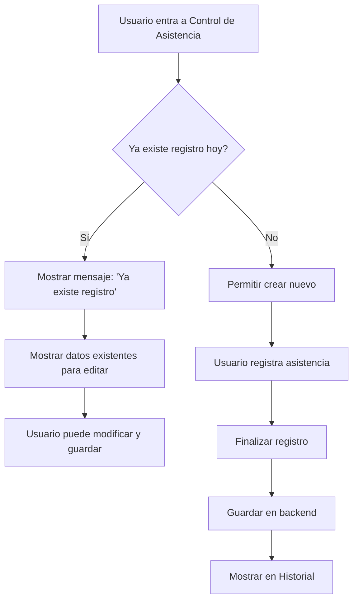

# Plan de Corrección: Módulo de Asistencia SIDAF-PUNO

## Problemas Identificados

### 1. Inconsistencia de Datos entre Control e Historial

**Actualmente:**
- **Control de asistencia**: Guarda UN registro por FECHA/ACTIVIDAD con TODOS los árbitros en un JSON dentro del campo `observaciones`
- **Historial de asistencia**: Espera UN registro por ÁRBITRO (con campo `idArbitro`)

**Archivo problemático:**
- [`useRegistroAsistencia.ts`](frontend/hooks/asistencia/useRegistroAsistencia.ts) línea 113:
  ```javascript
  observaciones: JSON.stringify(updated.arbitros)
  ```

### 2. No existe validación para evitar registros duplicados

- No hay verificación si ya existe asistencia para el día actual
- Se pueden crear múltiples registros de asistencia el mismo día

### 3. Campos adicionales sin usar

El backend tiene campos que no se están utilizando:
- `tipoDia` - Tipo de día (OBLIGATORIO, OPCIONAL, DESCANSO)
- `tieneRetraso` - Indicador de retraso
- `minutosRetraso` - Minutos de retraso
- `fechaLimiteRegistro` - Fecha límite para registrar
- `horaProgramada` - Hora programada
- `diaSemana` - Día de la semana

---

## Solución Propuesta

### Fase 1: Verificar si existe registro del día

1. **Modificar `useRegistroAsistencia.ts`** para verificar si ya existe un registro de asistencia para el día actual antes de iniciar uno nuevo
2. Agregar función para **cargar el registro existente** si lo hay

### Fase 2: Interfaz de usuario

1. **Si existe registro del día**: Mostrar mensaje informativo y permitir edición
2. **Si NO existe registro**: Permitir crear nuevo registro normalmente

### Fase 3: Guardar datos completos

El registro debe incluir:
- `fecha` - Fecha del registro
- `horaEntrada` - Hora de inicio
- `horaSalida` - Hora de fin
- `actividad` - Tipo de actividad
- `evento` - Descripción
- `responsable` - Nombre del responsable
- `observaciones` - JSON con lista de árbitros y estados
- **Nuevos campos**:
  - `tipoDia` - Tipo de día
  - `diaSemana` - Día de la semana
  - `horaProgramada` - Hora programada

---

## Implementación Requerida

### 1. Backend - Agregar endpoint para verificar asistencia del día

**Archivo**: `AsistenciaController.java`
```java
@GetMapping("/existe/{fecha}")
public boolean existeAsistencia(@PathVariable String fecha)
```

### 2. Frontend - Modificar useRegistroAsistencia.ts

**Cambios necesarios**:
1. Agregar estado para saber si ya existe registro
2. Cargar registro existente al iniciar
3. Modificar en lugar de crear nuevo si ya existe

### 3. Frontend - Modificar page.tsx (Control de Asistencia)

**Cambios necesarios**:
1. Verificar al cargar si existe registro del día
2. Mostrar notificación si ya existe
3. Mostrar datos existentes para editar

### 4. Frontend - Modificar historial/page.tsx

**Cambios necesarios**:
1. Parsear el campo `observaciones` (JSON) para mostrar cada árbitro
2. Agregar funcionalidad de edición

---

## Archivos a Modificar

| Archivo | Acción |
|---------|--------|
| `backend/src/main/java/com/sidaf/backend/controller/AsistenciaController.java` | Agregar endpoint `/existe/{fecha}` |
| `backend/src/main/java/com/sidaf/backend/repository/AsistenciaRepository.java` | Agregar método `findByFecha` |
| `frontend/hooks/asistencia/useRegistroAsistencia.ts` | Agregar verificación y carga de registro existente |
| `frontend/app/(dashboard)/dashboard/asistencia/page.tsx` | Agregar UI para editar registro existente |
| `frontend/app/(dashboard)/dashboard/asistencia/historial/page.tsx` | Parsear JSON y mostrar correctamente |
| `frontend/services/api.ts` | Agregar función `getAsistenciaByFecha` |

---

## Flujo Propuesto



---

## Notas Adicionales

1. El campo `observaciones` contiene un JSON con el formato:
   ```json
   [
     {"arbitroId": "1", "estado": "presente", "horaRegistro": "...", "observaciones": ""},
     {"arbitrId": "2", "estado": "ausente", "horaRegistro": "...", "observaciones": "Falta justificación"}
   ]
   ```

2. Para el historial, se debe parsear este JSON para mostrar cada registro individualmente

3. La validación de "un registro por día" debe ser por fecha + actividad
