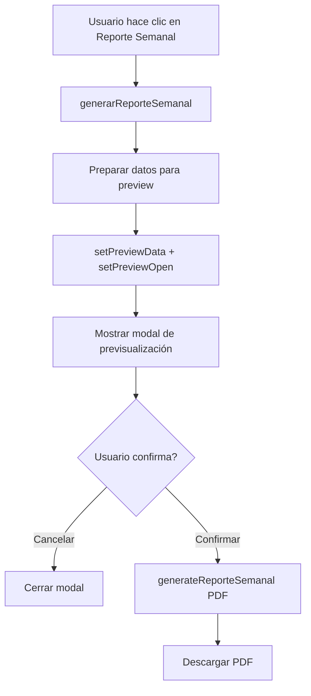

# Plan: Mejora del Reporte Semanal de Asistencia

## Problema Actual
El reporte semanal de asistencia (`handleExportarReporteSemanal` en `page.tsx:585-657`) actualmente:
1. Genera HTML directamente y abre una nueva ventana del navegador
2. NO muestra previsualización antes de descargar
3. NO genera un PDF real - usa `window.print()` del navegador

## Objetivo
Crear un reporte semanal en PDF profesional con previsualización antes de descargar, usando el mismo sistema de modal de预览 que ya existe para otros reportes.

## Análisis del Código Actual

### Preview existente en page.tsx:
- Estado: `previewOpen`, `previewData`, `previewTitulo`, `previewTipo` (líneas 84-88)
- Modal: Dialog en líneas 1129-1193
- Función de confirmación: `confirmarExportacion()` en líneas 525-543

### Funciones de exportación con preview:
- `handleExportarPDF()` - ✅ Usa preview (líneas 486-505)
- `handleExportarExcel()` - ✅ Usa preview (líneas 507-523)
- `handleExportarDia()` - ✅ Usa preview (líneas 371-398)
- `handleExportarReporteSemanal()` - ❌ NO usa preview (líneas 585-657)

## Plan de Implementación

### Paso 1: Agregar función de generación de PDF semanal
**Archivo:** `frontend/lib/pdf-generator.ts`

Crear nueva función `generateReporteSemanal()` que:
- Acepte: datos de árbitros, fecha inicio, fecha fin
- Genere PDF con jsPDF usando el mismo estilo corporativo
- Incluya tabla con columnas: Árbitro, Lun, Mar, Mié, Jue, Vie, Total
- Muestre estadísticas de presencia por día y total

### Paso 2: Modificar handleExportarReporteSemanal
**Archivo:** `frontend/app/(dashboard)/dashboard/asistencia/historial/page.tsx`

Cambiar el flujo actual:
1. Recolectar datos de la semana (ya hecho en `generarReporteSemanal`)
2. En lugar de generar HTML, preparar datos para preview
3. Llamar `setPreviewData()`, `setPreviewTitulo()`, `setPreviewTipo("pdf")`, `setPreviewOpen(true)`
4. Agregar caso en `confirmarExportacion()` para manejar reporte semanal

### Paso 3: Adaptar el modal de preview
**Archivo:** `frontend/app/(dashboard)/dashboard/asistencia/historial/page.tsx`

Modificar el modal de preview para manejar datos semanales:
- Detectar cuando `previewTitulo` contiene "Semanal"
- Mostrar estructura de tabla diferente (árbitros vs días)
- Incluir estadísticas resumidas

## Diagrama de Flujo

## Tareas Específicas

1. [ ] Crear función `generateReporteSemanal()` en `pdf-generator.ts`
2. [ ] Modificar `handleExportarReporteSemanal` para usar preview
3. [ ] Agregar caso especial en `confirmarExportacion` para semanal
4. [ ] Mejorar el modal de preview para mostrar datos semanales
5. [ ] Probar que la previsualización siempre se muestre antes de descargar

## Consideraciones de Diseño

- Mantener consistencia con el estilo corporativo SIDAF-PUNO
- Usar los mismos colores: primary blue [37, 99, 235]
- Incluir footer con fecha de generación
- Soporte para días obligatorios: Lun(1), Mar(2), Jue(4), Vie(5)
