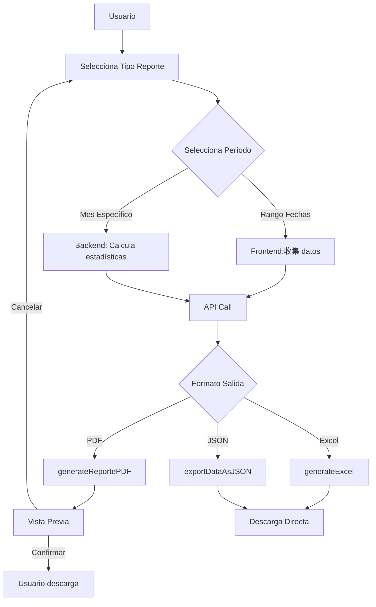

# Plan de Mejora de Reportes de Asistencia - SIDAF-PUNO

## 1. Análisis del Estado Actual

### 1.1 Componentes Existentes

| Componente | Ubicación | Estado |
|------------|-----------|--------|
| Historial de Asistencia | `frontend/app/(dashboard)/dashboard/asistencia/historial/page.tsx` | ✅ Funcional |
| Página de Reportes | `frontend/app/(dashboard)/dashboard/reportes/page.tsx` | ✅ Funcional |
| Ranking Semanal | `frontend/app/(dashboard)/dashboard/asistencia/ranking/page.tsx` | ✅ Funcional |
| Generador PDF | `frontend/lib/pdf-generator.ts` | ✅ Funcional |
| Endpoints Backend | `backend/src/main/java/com/sidaf/backend/controller/AsistenciaController.java` | ✅ Funcional |

### 1.2 Funcionalidades Actuales de Reportes

- **Reportes PDF**: Resumen ejecutivo, por árbitro, mensual, faltantes, diario
- **Exportación**: Excel (CSV), JSON
- **Filtros**: Por mes, actividad, árbitro
- **Estadísticas**: Básico (totales, porcentajes)

---

## 2. Áreas de Mejora Identificadas

### 2.1 Limitaciones Actuales

1. **PDF Básico**: Solo tablas simples sin gráficos
2. **Sin Dashboard Visual**: No hay gráficos en tiempo real
3. **Filtros Limitados**: Solo mes, actividad, árbitro
4. **Sin Exportación Completa**: Excel básico (CSV)
5. **Sin Reportes Comparativos**: No hay comparación entre períodos
6. **Sin Alertas**: No hay notificaciones de tendencias negatives

---

## 3. Plan de Implementación

### Fase 1: Mejoras del Backend

#### Tarea 1.1: Nuevos Endpoints de Reportes
```
[ ] GET /api/asistencias/reporte/consolidado?inicio=YYYY-MM-DD&fin=YYYY-MM-DD
    - Returns: Resumen completo con estadísticas por día, árbitro, actividad
    
[ ] GET /api/asistencias/reporte/tendencias?meses=6
    - Returns: Análisis de tendencias (mejora/decremento)
    
[ ] GET /api/asistencias/reporte/arbitro/{id}/completo
    - Returns: Historial completo de un árbitro específico
    
[ ] GET /api/asistencias/reporte/dias-faltantes
    - Returns: Lista de días obligatorios sin registro
```

#### Tarea 1.2: Mejora de Estadísticas
```
[ ] Agregar cálculo de:
    - Promedio móvil de asistencia (últimas 4 semanas)
    - Racha actual (consecutivas presentes/ausentes)
    - Comparativa vs período anterior
    - Top árbitros con mejor/peor asistencia
```

---

### Fase 2: Mejoras del Frontend

#### Tarea 2.1: Dashboard de Estadísticas en Tiempo Real
```
[ ] Crear componente dashboard-estadisticas-asistencia.tsx
    - Gráfico de barras: Asistencia por día de la semana
    - Gráfico de líneas: Tendencia mensual
    - Tarjetas KPIs: Asistencia %, Total, Presentes, Ausentes
    - Ranking: Top 5 mejores y peores árbitros
```

#### Tarea 2.2: Página de Reportes Mejorada
```
[ ] Redesenhhar page.tsx de reportes con:
    - Selector de período flexible (rango de fechas)
    - Selector de tipo de reporte (dropdown)
    - Vista previa antes de exportar
    - Progress indicator durante generación
```

#### Tarea 2.3: Mejora del Generador PDF
```
[ ] Agregar funciones:
    - generateReporteConsolidadoPDF() - Reporte completo con gráficos
    - generateReporteArbitroPDF() - Por árbitro específico
    - generateReporteComparativoPDF() - Comparación de períodos
    - Encabezado con logo y fecha
    - Footer con numeración de páginas
    - Gráficos embebidos (usando jspdf-autotable)
```

---

### Fase 3: Nuevas Funcionalidades

#### Tarea 3.1: Sistema de Alertas
```
[ ] Crear componente alertas-asistencia.tsx
    - Notificación cuando asistencia < 80%
    - Alerta de días sin registro
    - Recordatorio de días obligatorios próximos
```

#### Tarea 3.2: Reportes Programados
```
[ ] Agregar opción de programar reportes
    - Envío automático por email (futuro)
    - Configuración de frecuencia (semanal/mensual)
```

#### Tarea 3.3: Exportación Avanzada
```
[ ] Mejorar función exportAsistenciaToExcel():
    - Múltiples hojas (Resumen, Detalle, Árbitros)
    - Fórmulas de Excel (SUMA, PROMEDIO)
    - Formato condicional de colores
    
[ ] Agregar exportación a Google Sheets (opcional)
```

---

## 4. Estructura de Archivos a Crear/Modificar

### Nuevos Archivos

```
frontend/
├── components/
│   ├── dashboard-estadisticas-asistencia.tsx  [NUEVO]
│   ├── alertas-asistencia.tsx                  [NUEVO]
│   └── reporte-filtros.tsx                    [NUEVO]
├── lib/
│   └── pdf-generator.ts                        [MEJORAR]
└── app/(dashboard)/dashboard/
    └── asistencia/
        └── reportes/                           [NUEVO]
            └── page.tsx

backend/
└── src/main/java/com/sidaf/backend/
    ├── controller/
    │   └── AsistenciaController.java           [MEJORAR]
    ├── service/
    │   └── ReporteService.java                 [NUEVO]
    └── dto/
        └── ReporteConsolidadoDTO.java         [NUEVO]
```

---

## 5. Diagrama de Flujo - Generación de Reportes



---

## 6. Métricas de Éxito

| Métrica | Actual | Meta |
|---------|--------|------|
| Tipos de reporte | 5 | 12+ |
| Opciones de filtro | 3 | 8+ |
| Formatos exportación | 2 | 5+ |
| Gráficos en PDF | 0 | 4+ |
| Tiempo generación | ~5s | <2s |

---

## 7. Priorización de Tareas

### Alta Prioridad (Semana 1)
1. [ ] Nuevo endpoint: Reporte consolidado
2. [ ] Dashboard de estadísticas en tiempo real
3. [ ] Mejora del generador PDF (gráficos)

### Media Prioridad (Semana 2)
4. [ ] Filtros avanzados en página de reportes
5. [ ] Sistema de alertas básicas
6. [ ] Exportación Excel mejorada

### Baja Prioridad (Semana 3+)
7. [ ] Reportes programados
8. [ ] Exportación Google Sheets
9. [ ] Comparación de períodos

---

## 8. Consideraciones Técnicas

### Dependencias Necesarias
- `chart.js` - Para gráficos en frontend
- `react-chartjs-2` - Componentes React para Chart.js
- `jspdf-autotable` - Ya está en uso
- `xlsx` - Para exportación Excel avanzada

### Compatibilidad
- Mantener backwards compatibility con endpoints actuales
- Graceful degradation si falla algún endpoint
- Loading states apropiados

---

## 9. Resumen Ejecutivo

Este plan propone mejorar significativamente los reportes de asistencia mediante:

1. **Backend**: Nuevos endpoints para estadísticas avanzadas y reportes consolidados
2. **Frontend**: Dashboard visual en tiempo real con gráficos interactivos
3. **PDF**: Reportes más completos con gráficos embebidos
4. **Excel**: Exportación avanzada con múltiples hojas y formato
5. **UX**: Filtros avanzados, vista previa, y mejor experiencia de usuario

El resultado será un sistema de reportes robusto y completo que permitirá a la Comisión Departamental de Árbitros de Puno tomar decisiones informadas basadas en datos precisos y visualizaciones claras.
