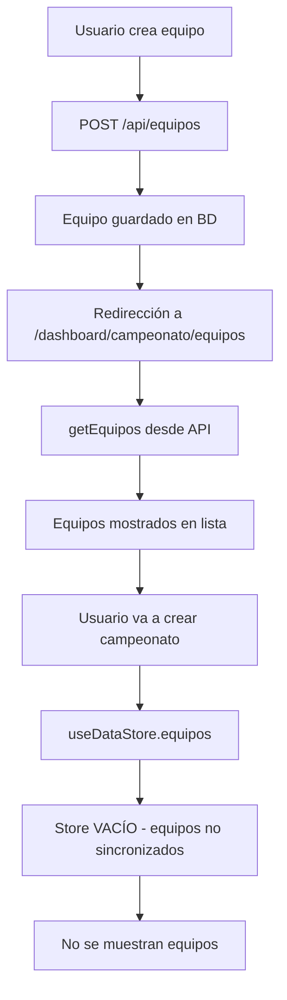
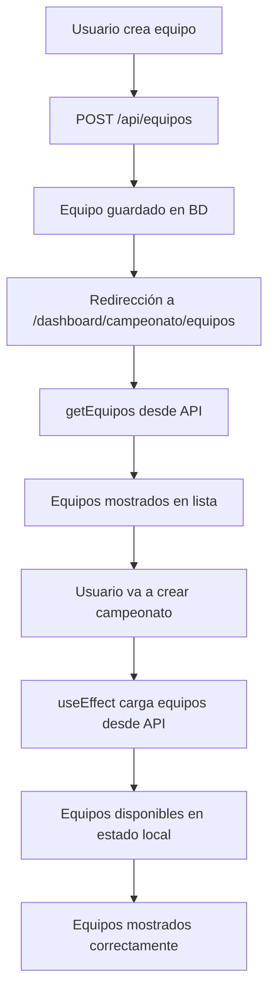
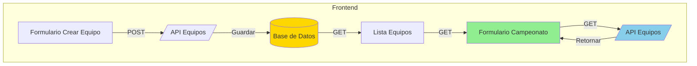

# Plan: Sincronización de Equipos en Formulario de Campeonato

## 📋 Descripción del Problema

Los equipos creados en el formulario `/dashboard/campeonato/equipos/nuevo` **NO** se visualizan en el formulario de creación de campeonatos `/dashboard/campeonato/nuevo`, específicamente en la sección "Equipos Participantes".

## 🔍 Análisis del Problema

### Flujo Actual (Con Problemas)



### Causa Raíz

1. **Desconexión entre API y Store**: 
   - La página de equipos usa directamente `getEquipos()` de la API
   - El formulario de campeonato usa `useDataStore().equipos` (Zustand store)
   - El store nunca se actualiza con los equipos del backend

2. **Inconsistencia en el flujo de datos**:
   - [`frontend/app/(dashboard)/dashboard/campeonato/equipos/page.tsx`](frontend/app/(dashboard)/dashboard/campeonato/equipos/page.tsx:20-32) - Carga equipos desde API
   - [`frontend/app/(dashboard)/dashboard/campeonato/nuevo/page.tsx`](frontend/app/(dashboard)/dashboard/campeonato/nuevo/page.tsx:21) - Usa `useDataStore().equipos`
   - [`frontend/lib/data-store.ts`](frontend/lib/data-store.ts:217-220) - Tiene `createEquipo` pero NO sincroniza con backend

3. **Tipos de datos incompatibles**:
   - Backend: `id` como `Integer`
   - Frontend Store: `id` como `string`
   - API: `id` como `number`

## 🎯 Solución Propuesta

### Estrategia Principal

Hacer que el formulario de campeonato cargue equipos directamente desde la API en lugar de usar el store local, similar a como funciona la página de equipos.

### Flujo Propuesto (Solución)



## 📝 Plan de Implementación

### Paso 1: Modificar el formulario de campeonato

**Archivo**: [`frontend/app/(dashboard)/dashboard/campeonato/nuevo/page.tsx`](frontend/app/(dashboard)/dashboard/campeonato/nuevo/page.tsx)

**Cambios requeridos**:

1. **Eliminar dependencia del store**:
   - Remover `useDataStore` del componente
   - Cambiar `const { equipos } = useDataStore()` por estado local

2. **Agregar carga de equipos desde API**:
   ```typescript
   const [equipos, setEquipos] = useState<Equipo[]>([])
   
   useEffect(() => {
       async function loadEquipos() {
           try {
               const data = await getEquipos()
               // Convertir IDs a string para compatibilidad
               const normalized = data.map(e => ({
                   ...e,
                   id: String(e.id)
               }))
               setEquipos(normalized)
           } catch (error) {
               console.error("Error cargando equipos:", error)
           }
       }
       loadEquipos()
   }, [])
   ```

3. **Actualizar imports**:
   - Agregar `useEffect` de React
   - Agregar `getEquipos` de `@/services/api`
   - Remover `useDataStore` de `@/lib/data-store`

### Paso 2: Asegurar consistencia de tipos

**Archivo**: [`frontend/services/api.ts`](frontend/services/api.ts)

El tipo `Equipo` ya tiene `id?: number`, lo cual es correcto para el backend.

**Archivo**: [`frontend/lib/data-store.ts`](frontend/lib/data-store.ts)

El tipo `Equipo` en el store tiene `id: string`, lo cual es correcto para el frontend.

La conversión se hará en el componente que consume los datos.

### Paso 3: Verificar página de equipos

**Archivo**: [`frontend/app/(dashboard)/dashboard/campeonato/equipos/page.tsx`](frontend/app/(dashboard)/dashboard/campeonato/equipos/page.tsx)

Esta página ya funciona correctamente porque:
- Usa `getEquipos()` directamente de la API (líneas 20-32)
- No depende del store local

### Paso 4: Actualizar página de creación de equipos

**Archivo**: [`frontend/app/(dashboard)/dashboard/campeonato/equipos/nuevo/page.tsx`](frontend/app/(dashboard)/dashboard/campeonato/equipos/nuevo/page.tsx)

Esta página ya funciona correctamente porque:
- Usa `createEquipo()` de la API (línea 48)
- Redirige a la lista de equipos después de crear (línea 50)

## 🔧 Implementación Detallada

### Modificación Principal: `frontend/app/(dashboard)/dashboard/campeonato/nuevo/page.tsx`

#### Cambios en Imports

**Antes**:
```typescript
import { useDataStore, type Campeonato } from "@/lib/data-store"
```

**Después**:
```typescript
import { useEffect, useState } from "react"
import { getEquipos, type Equipo } from "@/services/api"
import type { Campeonato } from "@/lib/data-store"
```

#### Cambios en el Componente

**Antes**:
```typescript
export default function NuevoCampeonatoPage() {
    const router = useRouter()
    const { addCampeonato, equipos } = useDataStore()
    // ... resto del código
```

**Después**:
```typescript
export default function NuevoCampeonatoPage() {
    const router = useRouter()
    const [equipos, setEquipos] = useState<Equipo[]>([])
    const [loadingEquipos, setLoadingEquipos] = useState(true)

    // Cargar equipos desde el backend
    useEffect(() => {
        async function loadEquipos() {
            try {
                const data = await getEquipos()
                // Normalizar IDs a string para compatibilidad con el formulario
                const normalized = data.map(e => ({
                    ...e,
                    id: String(e.id)
                }))
                setEquipos(normalized)
            } catch (error) {
                console.error("Error cargando equipos:", error)
            } finally {
                setLoadingEquipos(false)
            }
        }
        loadEquipos()
    }, [])
    // ... resto del código
```

#### Estado de Carga

Agregar indicador de carga mientras se obtienen los equipos:

```typescript
{loadingEquipos ? (
    <div className="text-center py-8">
        <p className="text-slate-500">Cargando equipos...</p>
    </div>
) : (
    // ... contenido existente
)}
```

## ✅ Criterios de Éxito

1. ✅ Los equipos creados en `/dashboard/campeonato/equipos/nuevo` aparecen en `/dashboard/campeonato/nuevo`
2. ✅ Los filtros de búsqueda funcionan correctamente
3. ✅ La selección de equipos funciona sin errores
4. ✅ Los equipos persisten después de recargar la página
5. ✅ No hay errores en la consola del navegador

## 🧪 Plan de Pruebas

### Prueba 1: Creación y Visualización de Equipo

1. Navegar a `/dashboard/campeonato/equipos`
2. Hacer clic en "Nuevo Equipo"
3. Completar el formulario con datos de prueba:
   - Nombre: "Club Deportivo Puno"
   - Categoría: "Primera División"
   - Provincia: "Puno"
   - Distrito: "Puno"
   - Colores: "Rojo"
4. Guardar el equipo
5. Navegar a `/dashboard/campeonato/nuevo`
6. **Resultado esperado**: El equipo "Club Deportivo Puno" aparece en la lista de equipos participantes

### Prueba 2: Filtros de Búsqueda

1. Con varios equipos creados
2. En `/dashboard/campeonato/nuevo`
3. Buscar por nombre: "Puno"
4. **Resultado esperado**: Solo se muestran equipos con "Puno" en el nombre
5. Filtrar por provincia: "Puno"
6. **Resultado esperado**: Solo se muestran equipos de la provincia Puno
7. Filtrar por división: "Primera División"
8. **Resultado esperado**: Solo se muestran equipos de Primera División

### Prueba 3: Selección de Equipos

1. En `/dashboard/campeonato/nuevo`
2. Seleccionar varios equipos
3. Verificar que el contador muestra el número correcto
4. Deseleccionar un equipo
5. **Resultado esperado**: El contador se actualiza correctamente

## 📊 Diagrama de Arquitectura de la Solución



## 🔄 Alternativas Consideradas

### Alternativa 1: Sincronizar Store con Backend

**Descripción**: Hacer que el store de Zustand se sincronice automáticamente con el backend.

**Ventajas**:
- Estado centralizado
- Menos llamadas a la API
- Consistencia en toda la app

**Desventajas**:
- Mayor complejidad
- Posibles problemas de sincronización
- Requiere refactorización significativa

**Decisión**: No implementar por ahora. La solución directa es más simple y mantenible.

### Alternativa 2: Usar React Query o SWR

**Descripción**: Implementar una biblioteca de gestión de estado del servidor.

**Ventajas**:
- Caching automático
- Revalidación inteligente
- Mejor experiencia de usuario

**Desventajas**:
- Nueva dependencia
- Curva de aprendizaje
- Sobrecarga para este caso de uso

**Decisión**: Considerar para futuro, pero no necesario para esta solución.

## 📌 Notas Importantes

1. **Compatibilidad con el commit actual**: Esta solución es compatible con el estado actual del código en el commit `afacd53`.

2. **Backward Compatibility**: Los cambios no rompen funcionalidad existente.

3. **Performance**: La carga de equipos es eficiente y solo ocurre al montar el componente.

4. **Error Handling**: Se incluye manejo de errores para casos donde la API no responda.

## 🚀 Próximos Pasos (Post-Implementación)

1. Considerar implementar sincronización automática del store con el backend
2. Agregar optimización de carga (React Query o similar)
3. Implementar actualización en tiempo real de equipos (WebSocket o polling)
4. Agregar tests unitarios para el componente de campeonato

## 📞 Contacto

Para cualquier duda o aclaración sobre este plan, contactar al equipo de desarrollo.
